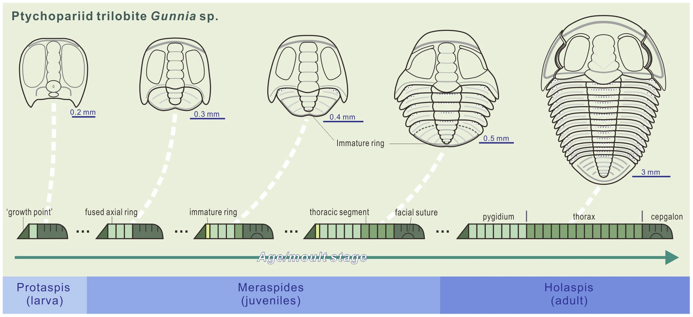

# PaleoSizeDB
PaleoSize Database--A database of fossil animal and protist body sizes

### This Repository is Under Development, please check back soon for updates

*Image: Shen, C., Clarkson, E., Yang, J. et al. Development and trunk segmentation of early instars of a ptychopariid trilobite from Cambrian Stage 5 of China. Sci Rep 4, 6970 (2014). [doi:10.1038/srep06970](https://doi.org/10.1038/srep06970/)*
