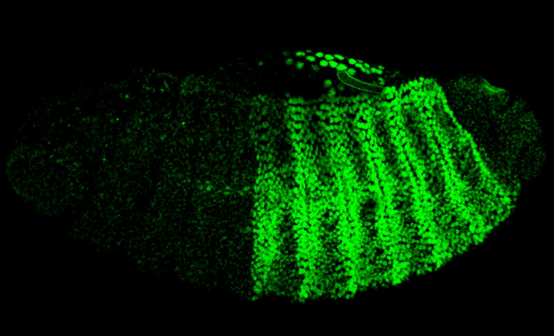

# PaleoSizeDB
PaleoSize Database--A database of fossil animal and protist body sizes

### This Repository is Under Development, please check back soon for updates

*Photo: Sedwick C (2012) Hox-PBC Partnership Demystified. PLoS Biol 10(6): e1001349. [doi:10.1371/journal.pbio.1001349](https://doi.org/10.1371/journal.pbio.1001349/)*
