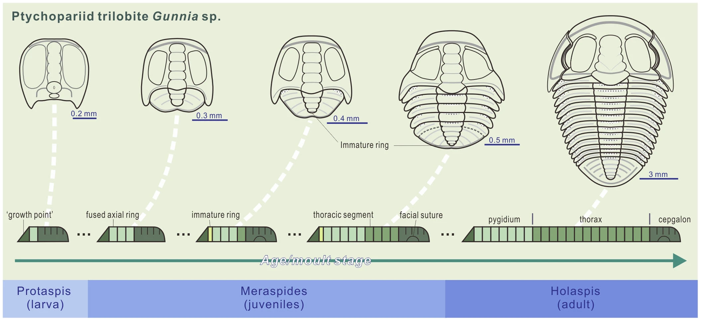

# PaleoSizeDB: A database of fossil animal and protist body sizes

## This Repository is Under Development, please check back soon for more updates

*Image: Shen, C., Clarkson, E., Yang, J. et al. Development and trunk segmentation of early instars of a ptychopariid trilobite from Cambrian Stage 5 of China. Sci Rep 4, 6970 (2014). [doi:10.1038/srep06970](https://doi.org/10.1038/srep06970)*

## The Database

The PaleoSize Database is an archive of body sizes for fossil marine animals--including quite a few genera whose range extends to the Recent. We currently focus on solitariy marine taxa from the following phyla: Arthropoda, Brachiopoda, Chordata, Echinodermata, and Mollusca. We also have sizes for benthic foraminifera. 

## The Data Files

Currently, we have two data files available in this repository. The first, [*genera_range_through.txt*](genera_range_through.txt) is a file with the total stratigraphic range, body size, and functional ecological mode for Phanerozoic marine genera. The second, [*species_sizes.txt*](species_sizes.txt), is compilation of species-level body sizes for species of marine animals and benthic foraminifera.

## The Data Collection Guide & Templates
The linked document, [measurement_guide.pdf](measurement_guide.pdf), provides a workflow for finding body size measurements from the literature and recording them in an excel spreadsheet. Importantly, the guide provides illustrations for the linear measurements that are to be taken for each Linnaean class. Below is a list of Excel templates for making body size measurements.

#### Excel Templates

* [Bivalvia](bivalveTemplate.xlsx) 
* [Gastropoda](gastropodTemplate.xlsx)
* [Cephalopod](cephalopodTemplate.xlsx)
* [Trilobita](trilobiteTemplate.xlsx)
* [Brachiopoda](brachiopodTemplate.xlsx)
* [Fish](fishTemplate.xlsx)
 